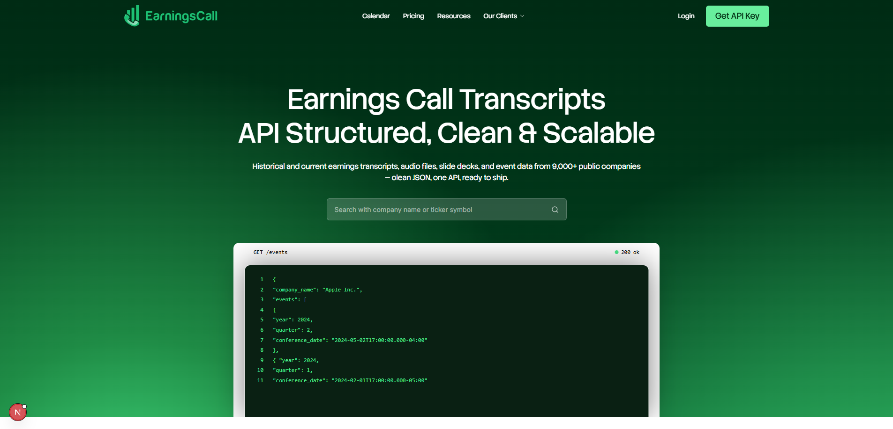
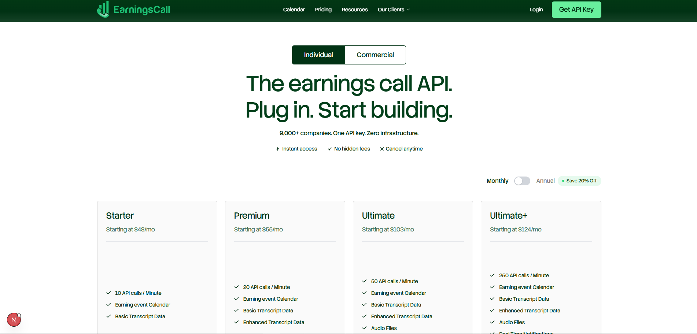

# EarningsCall — Earnings Call Transcripts API

A modern SaaS landing page for **EarningsCall**, a platform providing real-time earnings call transcripts, audio recordings, and structured financial data for 9,000+ companies. Built for developers, analysts, and investors.

---

## Live Demo

🔗 [View Live Demo](https://earningscall.biz/)

---

## Screenshots

> Replace the paths below with your actual screenshot images

### Hero Section


### Features Section


### Pricing Page


| Calendar Section |
|---|
|  |

---

## Tech Stack

| Technology | Purpose |
|---|---|
| [Next.js 15](https://nextjs.org/) | React framework with App Router |
| [Tailwind CSS v4](https://tailwindcss.com/) | Utility-first CSS styling |
| [Framer Motion](https://www.framer.com/motion/) | Animations and transitions |
| [React Hook Form](https://react-hook-form.com/) | Form handling |
| [Zod](https://zod.dev/) | Schema validation |
| [Lucide React](https://lucide.dev/) | Icon library |
| [clsx + tailwind-merge](https://github.com/dcastil/tailwind-merge) | Conditional class utilities |

---

## Features

- Full earnings call transcripts for 9,000+ companies
- Real-time audio streams and recordings
- Earnings call event calendar
- Enhanced transcript data with AI analysis
- Slide deck access
- Real-time notifications
- Redistribution rights for API users
- Responsive design — mobile, tablet, and desktop
- Smooth scroll animations powered by Framer Motion

---

## Installation

### Prerequisites

- Node.js 18.x or higher
- npm or yarn

### Steps

**1. Clone the repository**
```bash
git clone https://github.com/YourUsername/earningsCallweb.git
cd earningsCallweb
```

**2. Install dependencies**
```bash
npm install
```

**3. Run the development server**
```bash
npm run dev
```

**4. Open in browser**
```
http://localhost:3000
```

**5. Build for production**
```bash
npm run build
npm start
```

---

## Project Structure

```
earningsCallweb/
├── public/
│   ├── icons/              # SVG icons
│   ├── images/             # Static images (footer bg, app store badges)
│   └── logos/              # Company logos for marquee
│
├── src/
│   ├── app/
│   │   ├── (marketing)/
│   │   │   ├── layout.jsx          # Marketing layout (Navbar + Footer)
│   │   │   ├── page.jsx            # Home page
│   │   │   └── pricing/
│   │   │       └── page.jsx        # Pricing page
│   │   ├── globals.css             # Global styles & CSS variables
│   │   └── layout.jsx              # Root layout
│   │
│   ├── components/
│   │   ├── layout/
│   │   │   ├── navbar.jsx          # Navigation bar
│   │   │   ├── footer.jsx          # Footer
│   │   │   └── container.jsx       # Max-width container wrapper
│   │   │
│   │   └── sections/
│   │       ├── hero-section.jsx         # Hero with search & code preview
│   │       ├── logo-cloud-section.jsx   # Company logos marquee
│   │       ├── features-section.jsx     # API features grid
│   │       ├── feature-card.jsx         # Individual feature card
│   │       ├── calendar-section.jsx     # Earnings calendar preview
│   │       ├── benefits-section.jsx     # Platform benefits list
│   │       ├── use-cases-section.jsx    # Use cases with stats
│   │       ├── testimonials-section.jsx # User testimonials
│   │       ├── testimonial-card.jsx     # Individual testimonial card
│   │       ├── trusted-by-section.jsx   # Trusted by logos marquee
│   │       └── cta-section.jsx          # Call to action (split layout)
│   │
│   ├── data/
│   │   └── content.js              # All static content & copy
│   │
│   └── lib/
│       └── assets.js               # Asset path helpers
│
├── .gitignore
├── next.config.mjs
├── package.json
├── postcss.config.mjs
└── tailwind.config.js
```

---

## Pages

| Route | Description |
|---|---|
| `/` | Main landing page |
| `/pricing` | Pricing plans with FAQ and refund policy |

---

## Scripts

```bash
npm run dev       # Start development server
npm run build     # Build for production
npm run start     # Start production server
npm run lint      # Run ESLint
```

---

## Contributing

1. Fork the repository
2. Create a new branch: `git checkout -b feature/your-feature`
3. Commit your changes: `git commit -m "Add your feature"`
4. Push to the branch: `git push origin feature/your-feature`
5. Open a Pull Request

---

## License

This project is licensed under the [MIT License](LICENSE).

---

## Contact

Built by **Codixel** — [dev@codixel.tech](mailto:dev@codixel.tech)
